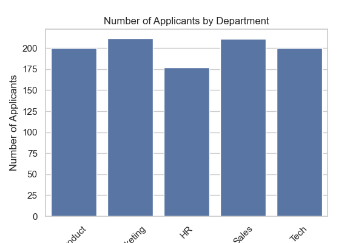
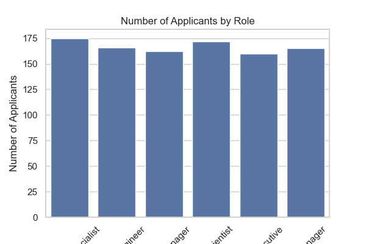
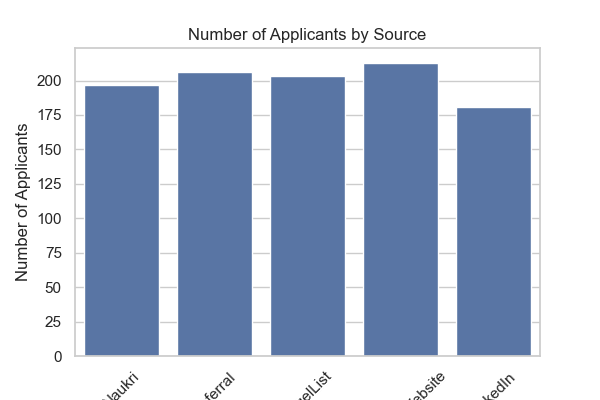
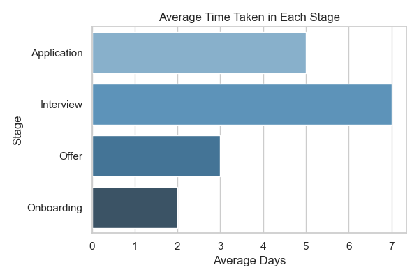
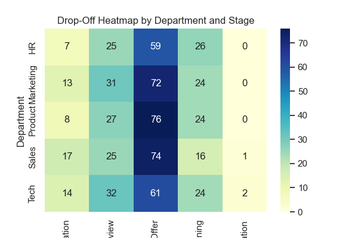
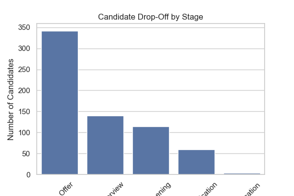

## **Smart Hiring Dashboard for Startups – Analyzing Job Application Funnel Efficiency**

### **Project Overview**
1. This project provides a comprehensive solution for startups to **analyze and visualize their hiring funnel**.
2. By generating **synthetic data** that mimics a real-world recruitment pipeline, we build a dashboard to track key hiring metrics.
3. The focus is on optimizing the **efficiency of the hiring funnel**, enabling startups to:
    - Identify bottlenecks  
    - Improve candidate experience  
    - Make data-driven recruitment decisions

---

### **Tools and Technologies**

#### **Python Libraries:**
| Library | Purpose |
|--------|---------|
| `pandas` | Data manipulation, cleaning, SQL query integration |
| `numpy` | Numerical operations and array handling |
| `faker` | Generate synthetic but realistic data (e.g., names, job roles, application dates) |
| `seaborn` & `matplotlib.pyplot` | Visualization and EDA (Exploratory Data Analysis) |
| `sqlite3` | Querying structured data using SQL in-memory |

#### **SQL:**
| Usage | Purpose |
|-------|---------|
| `SQL queries using pandas.read_sql_query()` | Used to calculate stage-wise conversion rates, including CTEs, JOINs, and conditional aggregation |

#### **Business Intelligence Tools:**
| Tool | Purpose |
|------|---------|
| **Power Query** | Clean and shape data in Power BI or Excel |
| **Power BI** | Create interactive dashboards with KPIs and filters |

---

### **Key Features**

- **Synthetic Data Generation**: Automatically generates a realistic hiring dataset with application dates, candidate details, job roles, and hiring stage progression.
- **Hiring Funnel Visualization**: Tracks candidates through each stage: Applied → Screened → Interviewed → Offered → Hired.
- **KPI Tracking**: Monitors key performance metrics:
  - Total applications
  - Offer acceptance rate
  - Time to hire
- **Interactive Dashboard**: 
  - Filters by job role, year, or department
  - Helps HR teams analyze trends and identify drop-off points

## **Main Dashboard**

## **Applicants by Department**

## **Applicants by Role**

## **Applicants by Source**

## **Average Time per Stage**

## **Drop-off Heatmap**

-

## **Drop-off by Stages**

